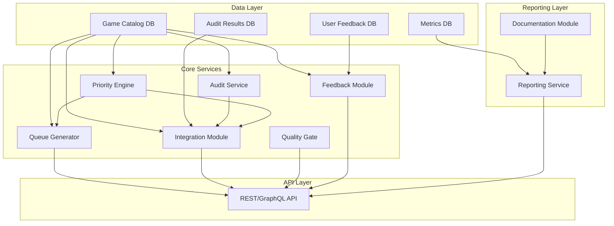

# Design Document: Game Quality and New Games Implementation

## Overview

This feature addresses the need to systematically improve existing games and implement new games from a catalog of 270+ documented game ideas. Currently, only 35 games are implemented, representing approximately 13% of the catalog. The design establishes a comprehensive framework for:

1. **Audit System**: Evaluating existing games across five quality dimensions
2. **Implementation Pipeline**: Standardizing new game creation with quality gates
3. **Priority Ranking**: Data-driven prioritization using weighted factors
4. **Success Metrics**: Tracking impact of improvements and new implementations
5. **Quality Gates**: Ensuring production-ready releases
6. **Feedback Loop**: Continuous improvement based on user data

The system is designed to be modular, extensible, and data-driven, enabling developers to make informed decisions about which games to improve and which new games to implement.

## Architecture

### High-Level Architecture



### Component Diagram

```mermaid
classDiagram
    class AuditService {
        +auditGame(gameId: string): AuditReport
        +calculateDimensionScores(game: Game): DimensionScores
        +flagForImprovement(scores: DimensionScores): boolean
        +generateReport(scores: DimensionScores): AuditReport
    }

    class PriorityEngine {
        +calculatePriority(game: Game): PriorityScore
        +normalizeFactor(value: number, min: number, max: number): number
        +calculateEducationalImpact(game: Game): number
        +calculateUserDemand(game: Game): number
        +categorizeScore(score: number): PriorityLevel
    }

    class QueueGenerator {
        +generateQueue(devAvailability: DeveloperAvailability): WorkQueue
        +sortGames(games: Game[]): Game[]
        +reorderOnPriorityChange(gameId: string): void
    }

    class QualityGate {
        +verifyForRelease(gameId: string): GateResult
        +checkAccessibility(game: Game): AccessibilityResult
        +generateReleaseCertificate(gameId: string): Certificate
    }

    class FeedbackModule {
        +extractMetrics(gameId: string): GameMetrics
        +analyzeFeedback(gameId: string): FeedbackAnalysis
        +generateDashboard(gameId: string): DashboardData
    }

    class IntegrationModule {
        +compareAuditAndCatalog(gameId: string): IntegrationResult
        +generateUnifiedPriorityList(): PriorityList
        +createVisualizations(): VisualizationData
    }

    class DocumentationModule {
        +generateChangeLog(gameId: string): ChangeLog
        +generateImplementationReport(gameId: string): Report
        +generateWeeklySummary(): WeeklySummary
    }

    AuditService --> AuditService: uses
    PriorityEngine --> PriorityEngine: uses
    QueueGenerator --> QueueGenerator: uses
    QualityGate --> QualityGate: uses
    FeedbackModule --> FeedbackModule: uses
    IntegrationModule --> IntegrationModule: uses
    DocumentationModule --> DocumentationModule: uses
```



## Components and Interfaces

### Audit Framework

The Audit Framework evaluates existing games across five dimensions:

```typescript
interface AuditFramework {
  auditGame(gameId: string): Promise<AuditReport>;
  calculateDimensionScores(game: Game): DimensionScores;
  flagForImprovement(scores: DimensionScores): boolean;
  generateReport(scores: DimensionScores): AuditReport;
}

interface DimensionScores {
  educationalValue: number; // 1-5
  userExperience: number; // 1-5
  technicalQuality: number; // 1-5
  accessibility: number; // 1-5
  contentCompleteness: number; // 1-5
}

interface AuditReport {
  gameId: string;
  scores: DimensionScores;
  totalScore: number;
  flaggedForImprovement: boolean;
  recommendations: ImprovementRecommendation[];
  timestamp: string;
}
```

### Priority Engine

The Priority Engine calculates weighted priority scores:

```typescript
interface PriorityEngine {
  calculatePriority(game: Game): PriorityScore;
  normalizeFactor(value: number, min: number, max: number): number;
  calculateEducationalImpact(game: Game): number;
  calculateUserDemand(game: Game): number;
  categorizeScore(score: number): PriorityLevel;
}

interface PriorityScore {
  total: number;
  educationalImpact: number; // 40% weight
  userDemand: number; // 30% weight
  implementationEffort: number; // 20% weight
  strategicAlignment: number; // 10% weight
}

type PriorityLevel = 'P0' | 'P1' | 'P2' | 'P3';
```

### Quality Gate

The Quality Gate ensures production-ready releases:

```typescript
interface QualityGate {
  verifyForRelease(gameId: string): Promise<GateResult>;
  checkAccessibility(game: Game): AccessibilityResult;
  generateReleaseCertificate(gameId: string): Certificate;
}

interface GateResult {
  passed: boolean;
  failedChecks: string[];
  detailedFailures: FailureDetails[];
}

interface AccessibilityResult {
  colorContrast: boolean;
  keyboardNavigation: boolean;
  screenReaderSupport: boolean;
  timeoutOptions: boolean;
}
```

### Feedback Module

The Feedback Module analyzes user interaction data:

```typescript
interface FeedbackModule {
  extractMetrics(gameId: string): Promise<GameMetrics>;
  analyzeFeedback(gameId: string): Promise<FeedbackAnalysis>;
  generateDashboard(gameId: string): DashboardData;
}

interface GameMetrics {
  playCount: number;
  completionRate: number;
  averageScore: number;
  timeOnTask: number;
  errorRate: number;
}

interface FeedbackAnalysis {
  meetsBenchmark: boolean;
  deviationFromBenchmark: number;
  improvementSuggestions: Suggestion[];
}
```

## Data Models

### Game Catalog Entry

```typescript
interface GameCatalogEntry {
  gameId: string;
  gameName: string;
  educationalObjectives: string[];
  difficultyLevel: DifficultyLevel;
  estimatedTime: number; // in hours
  requiredTechnologies: string[];
  successCriteria: string[];
  priority: PriorityLevel;
  priorityScore: number;
  auditScores?: DimensionScores;
  implementationStatus: 'not_started' | 'in_progress' | 'completed';
  estimatedEffort?: number;
  dependencies: string[];
}
```

### Audit Results

```typescript
interface AuditResult {
  gameId: string;
  auditDate: string;
  scores: DimensionScores;
  totalScore: number;
  flaggedForImprovement: boolean;
  recommendations: ImprovementRecommendation[];
  auditorId: string;
}
```

### Priority Score Components

```typescript
interface EducationalImpact {
  curriculumAlignment: number; // 0-100
  ageRangeBreadth: number; // 0-100
  skillDiversity: number; // 0-100
}

interface UserDemand {
  userFeedbackScore: number; // 0-100
  playCount: number;
  completionRate: number; // 0-100
}

interface PriorityFactors {
  educationalImpact: EducationalImpact;
  userDemand: UserDemand;
  implementationEffort: number; // 0-100, inverted (lower effort = higher score)
  strategicAlignment: number; // 0-100
}
```

### Metrics Tracking

```typescript
interface GameMetrics {
  gameId: string;
  timestamp: string;
  qualityScoreImprovement: number;
  userEngagementChange: number;
  completionRateChange: number;
  bugReportReduction: number;
  averageSessionDuration: number;
  repeatPlayRate: number;
  feedbackScore: number;
}
```

## Correctness Properties

*A property is a characteristic or behavior that should hold true across all valid executions of a system-essentially, a formal statement about what the system should do. Properties serve as the bridge between human-readable specifications and machine-verifiable correctness guarantees.*

### Property 1: Audit evaluates all five dimensions

*For any* game in the catalog, when the Audit Framework audits the game, it SHALL evaluate all five dimensions: Educational_Value, User_Experience, Technical_Quality, Accessibility, and Content_Completeness, and return scores for each dimension.

**Validates: Requirements 1.1**

### Property 2: Dimension scores are within valid range

*For any* game audit, when dimension scores are calculated, each score SHALL be an integer between 1 and 5, inclusive, where 1 = Critical Issues, 2 = Needs Improvement, 3 = Acceptable, 4 = Good, and 5 = Excellent.

**Validates: Requirements 1.2**

### Property 3: Games with low dimension scores are flagged

*For any* game audit, if any dimension score is below 3, then the game SHALL be flagged for improvement by the Audit Framework.

**Validates: Requirements 1.3**

### Property 4: Games with low total scores are recommended for improvement

*For any* game audit, if the total audit score is below 12 (out of 25), then the game SHALL be recommended for improvement priority by the Audit Framework.

**Validates: Requirements 1.4**

### Property 5: Audit reports include improvement recommendations

*For any* completed game audit, the Audit Framework SHALL generate a detailed report that includes specific improvement recommendations for each dimension that scored below 5.

**Validates: Requirements 1.5**

### Property 6: Implementation gate validates required fields

*For any* game catalog entry selected for implementation, the Implementation_Gate SHALL verify that all required fields (Game_Name, Educational_Objectives, Difficulty_Level, Estimated_Time, Required_Technologies, and Success_Criteria) are present, and block implementation if any field is missing.

**Validates: Requirements 2.1, 2.2**

### Property 7: Implementation plans include required tasks

*For any* game catalog entry that passes the Implementation Gate, the generated Implementation_Plan SHALL include unit test requirements, accessibility checks, and documentation tasks.

**Validates: Requirements 2.4, 2.5**

### Property 8: Priority scores use correct weighting

*For any* game, when the Priority_Engine calculates the priority score, the total score SHALL be calculated as: Educational_Impact * 0.4 + User_Demand * 0.3 + Implementation_Effort * 0.2 + Strategic_Alignment * 0.1, where all factors are normalized to 0-100.

**Validates: Requirements 3.1, 3.2**

### Property 9: Priority categorization follows correct thresholds

*For any* calculated priority score, the Priority_Engine SHALL categorize the game as: P0 (90-100), P1 (70-89), P2 (50-69), P3 (0-49).

**Validates: Requirements 3.5**

### Property 10: Priority changes are logged

*For any* game where the priority score changes due to new data, the Priority_Engine SHALL log the change with timestamp and update the priority list.

**Validates: Requirements 3.6**

### Property 11: Metrics collector tracks all required metrics

*For any* game improvement or new game launch, the Metrics_Collector SHALL track: Quality_Score_Improvement, User_Engagement_Change, Completion_Rate_Change, and Bug_Report_Reduction.

**Validates: Requirements 4.1, 5.1**

### Property 12: User engagement metrics include all components

*For any* user engagement measurement, the Metrics_Collector SHALL track: Average_Session_Duration, Repeat_Play_Rate, and Feedback_Score.

**Validates: Requirements 4.3, 5.3**

### Property 13: Engagement rate calculation is correct

*For any* new game launch, when the engagement rate is calculated, it SHALL use the formula: (Unique_Players / Total_Users) * 100.

**Validates: Requirements 5.3**

### Property 14: Low engagement games are flagged

*For any* new game with an engagement rate below 15% after 30 days, the Metrics_Collector SHALL flag it for review.

**Validates: Requirements 5.4**

### Property 15: Work queue is sorted by priority

*For any* generated work queue, games SHALL be sorted by priority score with P0 games first, then P1, P2, and P3.

**Validates: Requirements 6.1**

### Property 16: P0 games are sorted by impact and effort

*For any* set of P0 games in the work queue, games SHALL be sorted by Educational_Impact in descending order, and for games with equal Educational_Impact, by Implementation_Effort in ascending order.

**Validates: Requirements 6.3**

### Property 17: Queue includes all required fields

*For any* work queue entry, the queue SHALL provide: Game_Name, Priority, Estimated_Effort_Hours, Dependencies, and Recommended_Start_Date.

**Validates: Requirements 6.4**

### Property 18: Priority changes trigger queue reordering

*For any* game where the priority changes, the Queue_Generator SHALL automatically reorder the queue and notify the development team.

**Validates: Requirements 6.5**

### Property 19: Integration module compares audit and catalog scores

*For any* existing game audit, the Integration_Module SHALL compare audit scores to catalog priority scores and generate integration results.

**Validates: Requirements 7.1**

### Property 20: High audit score, low catalog priority triggers re-prioritization

*For any* existing game with high audit scores (total >= 18) but low catalog priority (P2 or P3), the Integration_Module SHALL recommend re-prioritization.

**Validates: Requirements 7.2**

### Property 21: Low quality indicators trigger research recommendations

*For any* new game from catalog with low quality indicators (estimated completion rate < 50% or estimated engagement < 20%), the Integration_Module SHALL recommend additional research before implementation.

**Validates: Requirements 7.3**

### Property 22: Unified priority list is generated

*For any* combination of audit and catalog data, the Integration_Module SHALL generate a unified priority list that considers both audit scores and catalog priorities.

**Validates: Requirements 7.4**

### Property 23: Visualizations include required charts

*For any* integration result, the Integration_Module SHALL provide visualizations showing: Audit_Score vs Catalog_Priority, and Implementation_Effort vs Educational_Impact.

**Validates: Requirements 7.5**

### Property 24: Documentation includes all required sections

*For any* completed game improvement or implementation, the Documentation_Module SHALL generate reports that include: Before_After_Comparisons, Key_Decisions, Lessons_Learned, and Next_Steps.

**Validates: Requirements 8.2**

### Property 25: Metrics reports include all required metrics

*For any* metrics report, the Documentation_Module SHALL include: Absolute_Change, Percentage_Change, and Statistical_Significance.

**Validates: Requirements 8.3**

### Property 26: Reports are stored in correct directories

*For any* generated report, the Documentation_Module SHALL store improvement reports in docs/game_improvements/ and implementation reports in docs/game_implementations/.

**Validates: Requirements 8.4**

### Property 27: Weekly summaries include all required metrics

*For any* weekly summary report, the Documentation_Module SHALL include: Games_Improved, Games_Implemented, Total_Effort_Hours, and Impact_Score.

**Validates: Requirements 8.5**

### Property 28: Quality gate verifies all required checks

*For any* game ready for production release, the Quality_Gate SHALL verify: All_Audit_Checks_Passed, All_Tests_Passed, Accessibility_Compliance, and Documentation_Complete.

**Validates: Requirements 9.1**

### Property 29: Failed quality gate checks block release

*For any* game where a quality gate check fails, the Quality_Gate SHALL block release and provide detailed failure reasons.

**Validates: Requirements 9.2**

### Property 30: Accessibility compliance checks all criteria

*For any* game accessibility check, the Quality_Gate SHALL verify: Color_Contrast_Ratio >= 4.5:1, Keyboard_Navigation, Screen_Reader_Support, and Timeout_Options.

**Validates: Requirements 9.3**

### Property 31: Passed quality gate generates certificate

*For any* game where all quality gate checks pass, the Quality_Gate SHALL generate a Release_Certificate and update game status to "Production".

**Validates: Requirements 9.4**

### Property 32: Quality gate maintains audit trail

*For any* quality gate check, the Quality_Gate SHALL maintain an audit trail with timestamps and reviewer information.

**Validates: Requirements 9.5**

### Property 33: Feedback module extracts all required metrics

*For any* game's user interaction data, the Feedback_Module SHALL extract: Play_Count, Completion_Rate, Average_Score, Time_On_Task, and Error_Rate.

**Validates: Requirements 10.1**

### Property 34: Feedback analysis compares against benchmarks

*For any* game's feedback analysis, the Feedback_Module SHALL compare metrics against game-specific benchmarks.

**Validates: Requirements 10.2**

### Property 35: Low completion rate triggers review recommendation

*For any* game where the completion rate is below benchmark by more than 20%, the Feedback_Module SHALL recommend review.

**Validates: Requirements 10.3**

### Property 36: Feedback analysis generates improvement suggestions

*For any* completed feedback analysis, the Feedback_Module SHALL generate improvement suggestions with supporting data.

**Validates: Requirements 10.4**

### Property 37: Dashboard includes all required elements

*For any* game dashboard, the Feedback_Module SHALL show: Game_Health_Score, Recent_Changes, and Recommended_Actions.

**Validates: Requirements 10.5**

## Error Handling

### Audit Framework Errors

| Error Type | Handling Strategy |
|------------|-------------------|
| Game not found | Return 404 with error message |
| Audit calculation failure | Log error, return partial results with null scores |
| Database connection failure | Retry with exponential backoff, return error after 3 attempts |

### Priority Engine Errors

| Error Type | Handling Strategy |
|------------|-------------------|
| Missing data for calculation | Use default values (50 for normalized scores) |
| Invalid input data | Validate input, return error with descriptive message |
| Calculation overflow | Cap values at 0-100 range |

### Quality Gate Errors

| Error Type | Handling Strategy |
|------------|-------------------|
| Test execution failure | Block release, log detailed error |
| Accessibility check timeout | Flag as pending, allow manual override |
| Certificate generation failure | Log error, retry with fallback mechanism |

### Feedback Module Errors

| Error Type | Handling Strategy |
|------------|-------------------|
| Data collection failure | Use cached data, log warning |
| Benchmark not found | Use industry average as fallback |
| Analysis timeout | Return partial results with timeout flag |

## Testing Strategy

### Dual Testing Approach

This design requires both unit testing and property-based testing to ensure comprehensive coverage:

- **Unit tests**: Verify specific examples, edge cases, and error conditions
- **Property tests**: Verify universal properties across all inputs
- Both are complementary and necessary for comprehensive coverage

### Property-Based Testing Configuration

- **Library**: fast-check (TypeScript/JavaScript) or pytest-quickcheck (Python)
- **Minimum iterations**: 100 per property test
- **Tag format**: `Feature: game-quality-and-new-games, Property {number}: {property_text}`

### Unit Testing Balance

Unit tests should focus on:

- Specific examples that demonstrate correct behavior
- Integration points between components
- Edge cases and error conditions
- Boundary values (e.g., score = 1, 5, 12, 25)

Property tests should focus on:

- Universal properties that hold for all inputs
- Comprehensive input coverage through randomization
- Mathematical relationships (e.g., weighted sums, thresholds)
- Invariants (e.g., scores always in 1-5 range)

### Property Test Examples

```typescript
// Property 2: Dimension scores are within valid range
property(genGame, (game) => {
  const scores = auditService.calculateDimensionScores(game);
  return Object.values(scores).every(score => score >= 1 && score <= 5);
});

// Property 8: Priority scores use correct weighting
property(genGame, (game) => {
  const priority = priorityEngine.calculatePriority(game);
  const expected = 
    priority.educationalImpact * 0.4 +
    priority.userDemand * 0.3 +
    priority.implementationEffort * 0.2 +
    priority.strategicAlignment * 0.1;
  return Math.abs(priority.total - expected) < 0.01;
});

// Property 15: Work queue is sorted by priority
property(genGameArray, (games) => {
  const queue = queueGenerator.generateQueue(games);
  const priorityOrder = { 'P0': 0, 'P1': 1, 'P2': 2, 'P3': 3 };
  for (let i = 0; i < queue.length - 1; i++) {
    if (priorityOrder[queue[i].priority] > priorityOrder[queue[i+1].priority]) {
      return false;
    }
  }
  return true;
});
```

### Test Coverage Requirements

- **Audit Framework**: 100% coverage of dimension scoring logic
- **Priority Engine**: 100% coverage of normalization and weighting logic
- **Quality Gate**: 100% coverage of accessibility checks
- **Feedback Module**: 100% coverage of metric extraction logic

## Error Handling

### Audit Framework Errors

| Error Type | Handling Strategy |
|------------|-------------------|
| Game not found | Return 404 with error message |
| Audit calculation failure | Log error, return partial results with null scores |
| Database connection failure | Retry with exponential backoff, return error after 3 attempts |

### Priority Engine Errors

| Error Type | Handling Strategy |
|------------|-------------------|
| Missing data for calculation | Use default values (50 for normalized scores) |
| Invalid input data | Validate input, return error with descriptive message |
| Calculation overflow | Cap values at 0-100 range |

### Quality Gate Errors

| Error Type | Handling Strategy |
|------------|-------------------|
| Test execution failure | Block release, log detailed error |
| Accessibility check timeout | Flag as pending, allow manual override |
| Certificate generation failure | Log error, retry with fallback mechanism |

### Feedback Module Errors

| Error Type | Handling Strategy |
|------------|-------------------|
| Data collection failure | Use cached data, log warning |
| Benchmark not found | Use industry average as fallback |
| Analysis timeout | Return partial results with timeout flag |
