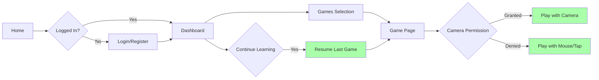

# UX Flow Analysis: Learning Application for Children Ages 3-8

## Executive Summary

Comprehensive analysis of user flows, focusing on game start flows, settings persistence, and quick resume functionality for children ages 3-8. The analysis reveals several areas for improvement in the user experience, particularly around the inconsistent routing pattern where the alphabet game uses `/game` while all other games follow the `/games/*` pattern.

## Complete UX Flow Analysis

### Phase 1: Discovery

#### 1.1 Identify User Personas

List the primary user types and their goals:

**Young Learner (Ages 3-5)**

- Age range: 3-5 years
- Technical skill: Low (requires adult supervision)
- Primary goal: Explore letters and numbers through fun, interactive games
- Frustration tolerance: Low (gets frustrated easily with complex interfaces)
- Needs: Large touch targets, simple navigation, visual feedback, minimal text

**Independent Learner (Ages 6-8)**

- Age range: 6-8 years
- Technical skill: Medium (can navigate with minimal help)
- Primary goal: Practice letters and numbers independently
- Frustration tolerance: Medium (can handle minor challenges)
- Needs: Clear instructions, progress tracking, achievement recognition

**Parent/Guardian**

- Age range: Adult
- Technical skill: Medium to High
- Primary goal: Set up learning environment, monitor progress, adjust settings
- Frustration tolerance: Medium (wants efficient setup and clear progress tracking)
- Needs: Easy profile creation, progress reports, parental controls, privacy assurance

#### 1.2 Map All Entry Points

Find where users can start their journey:

**Direct URLs:**

- `/` (Home page)
- `/login` (Login page)
- `/register` (Registration page)
- `/dashboard` (Dashboard - protected)
- `/games` (Games selection page - protected)
- `/game` (Alphabet game - protected)
- `/games/finger-number-show` (Finger counting game - protected)
- `/games/connect-the-dots` (Connect the dots game - protected)
- `/games/letter-hunt` (Letter hunt game - protected)
- `/settings` (Settings page - protected)
- `/progress` (Progress page - protected)

**Navigation links:**

- From Home page: Register/Login buttons
- From Login page: Link to Register
- From Register page: Link to Login
- From Dashboard: Quick play button to `/game`
- From Games page: Individual game cards leading to specific game routes

**Deep links:**

- Profile selection modal from Games page
- Direct game access from Dashboard "Continue Learning" section

**Redirects from auth:**

- After login: Redirect to Dashboard (`/dashboard`)
- After registration: Redirect to Dashboard (`/dashboard`)
- Unauthenticated access to protected routes: Redirect to Login (`/login`)

#### 1.3 Identify Core User Stories

For each major feature, document:

**As a Young Learner (3-5 years),**
I want to easily start a game with minimal steps,
So that I can quickly engage with the learning activity without getting frustrated.

Acceptance criteria:

- [ ] One-click access to favorite games
- [ ] Visual cues and large buttons
- [ ] Simple navigation without complex decisions

**As an Independent Learner (6-8 years),**
I want to select and start a game myself,
So that I can practice letters and numbers independently.

Acceptance criteria:

- [ ] Clear game selection interface
- [ ] Ability to resume previous progress
- [ ] Intuitive game controls

**As a Parent/Guardian,**
I want to set up my child's profile and preferences,
So that the learning experience is tailored to their needs.

Acceptance criteria:

- [ ] Easy profile creation process
- [ ] Language selection options
- [ ] Settings that persist across sessions

**As a Returning User,**
I want to quickly resume where I left off,
So that I don't lose my progress and can continue learning seamlessly.

Acceptance criteria:

- [ ] Session state restoration
- [ ] Quick access to last played game
- [ ] Progress preservation

**As a User with Limited Camera Access,**
I want to play games even without camera permission,
So that I can still learn even in restricted environments.

Acceptance criteria:

- [ ] Fallback to mouse/touch mode
- [ ] Clear indication of camera status
- [ ] Full functionality without camera

### Phase 2: Flow Mapping

#### 2.1 Click-Path Analysis

For each core journey, count clicks/taps to completion:

| Journey | Steps | Path | Friction Points |
|---------|-------|------|-----------------|
| New User Registration | 4 | Home → Register → Dashboard → Games → Select Game | Multiple steps required before reaching games |
| Returning User (Quick Resume) | 2 | Dashboard → "Continue Learning" | Efficient path for resuming |
| Returning User (Game Selection) | 3 | Dashboard → Games → Select Game | Moderate complexity |
| Direct Game Access | 2 | Games → Select Game | Direct path once authenticated |

**Red flags:**

- New users need 4+ clicks to reach first game (exceeds recommended 3 clicks)
- Profile selection required before certain games (adds extra step)
- Camera permission request during game start (potential barrier)

**Optimal Paths:**

- Returning users can reach games in 2-3 clicks
- "Continue Learning" button provides quick access to last game

#### 2.2 Decision Point Audit

List every place users must make a choice:

- Location: Games page
  - Decision: Which game to play
  - Options: 4 games available (Alphabet Tracing, Finger Number Show, Connect the Dots, Letter Hunt)
  - Reversible: Yes
  - Default provided: No, but Alphabet Tracing highlighted

- Location: Profile selection modal
  - Decision: Which child profile to use
  - Options: All created profiles + "Add New Profile"
  - Reversible: Yes
  - Default provided: First profile selected by default

- Location: Settings page
  - Decision: Various settings configurations
  - Options: Multiple (language, difficulty, camera, sound, etc.)
  - Reversible: Yes (with reset option)
  - Default provided: Yes, for all settings

- Location: Camera permission request
  - Decision: Allow or deny camera access
  - Options: 2 (Allow/Deny)
  - Reversible: Yes (can change later in settings)
  - Default provided: Browser-dependent

- Location: Game start
  - Decision: Start game or adjust settings
  - Options: Start game, adjust settings, or use mouse mode
  - Reversible: Yes
  - Default provided: Game starts with current settings

- Location: Wellness reminders
  - Decision: Continue playing or take break
  - Options: Postpone, take break, or continue
  - Reversible: Yes
  - Default provided: Postpone option

- Location: Exit confirmation
  - Decision: Save and exit or continue playing
  - Options: Save & Exit, Continue
  - Reversible: Yes (if choose Continue)
  - Default provided: No (modal appears on Escape press)

**Red flags:**

- Settings page has many options without clear recommendations for novice users
- Camera permission decision is critical but irreversible without changing browser settings
- Wellness reminders interrupt gameplay (though postponable)

#### 2.3 State Persistence Check

For each user preference/setting:

- Setting: UI Language
  - Stored: Yes
  - Where: localStorage via zustand persist middleware
  - Survives refresh: Yes
  - Survives logout: Yes

- Setting: Game Language
  - Stored: Yes
  - Where: localStorage via zustand persist middleware
  - Survives refresh: Yes
  - Survives logout: Yes

- Setting: Difficulty
  - Stored: Yes
  - Where: localStorage via zustand persist middleware
  - Survives refresh: Yes
  - Survives logout: Yes

- Setting: Camera Enabled
  - Stored: Yes
  - Where: localStorage via zustand persist middleware
  - Survives refresh: Yes
  - Survives logout: Yes

- Setting: Sound Enabled
  - Stored: Yes
  - Where: localStorage via zustand persist middleware
  - Survives refresh: Yes
  - Survives logout: Yes

- Setting: Time Limit
  - Stored: Yes
  - Where: localStorage via zustand persist middleware
  - Survives refresh: Yes
  - Survives logout: Yes

- Setting: Show Hints
  - Stored: Yes
  - Where: localStorage via zustand persist middleware
  - Survives refresh: Yes
  - Survives logout: Yes

- Setting: Hand Tracking Delegate
  - Stored: Yes
  - Where: localStorage via zustand persist middleware
  - Survives refresh: Yes
  - Survives logout: Yes

- Setting: Camera Permission State
  - Stored: Yes
  - Where: localStorage via zustand persist middleware
  - Survives refresh: Yes
  - Survives logout: Yes

- Setting: Tutorial Completed
  - Stored: Yes
  - Where: localStorage via zustand persist middleware
  - Survives refresh: Yes
  - Survives logout: Yes

- Setting: Onboarding Completed
  - Stored: Yes
  - Where: localStorage via zustand persist middleware
  - Survives refresh: Yes
  - Survives logout: Yes

- Profile Information
  - Stored: Yes
  - Where: Backend database + local state
  - Survives refresh: Yes (fetched on load)
  - Survives logout: No (backend stored, but requires auth)

- Game Progress
  - Stored: Yes
  - Where: Backend database + local state + localStorage
  - Survives refresh: Yes
  - Survives logout: Partially (local cache cleared on logout)

- Current Game Session State
  - Stored: Yes
  - Where: localStorage
  - Survives refresh: Yes
  - Survives logout: No (cleared on logout)

**Red flags:**

- Some settings survive logout when they might need to be user-specific
- Game progress is stored both locally and on backend, which could lead to sync issues
- Session state is cleared on logout, which might affect cross-device continuity

### Phase 3: Friction Analysis

#### 3.1 Loading States

For each async operation:

- Games page: Has loading states with motion animations
- Alphabet game: Has loading states during hand tracking initialization
- Profile fetching: Shows loading indicators
- Camera initialization: Has loading feedback

#### 3.2 Error States

For each possible error:

- Camera permission denied: Shows clear error message and falls back to mouse mode
- Network errors: Handled with toast notifications
- Authentication errors: Redirect to login
- Game-specific errors: Handled with feedback messages

#### 3.3 Empty States

For each list/collection:

- Dashboard: Shows "Add Child" empty state when no profiles exist
- Progress tracking: Shows "No progress recorded" when no data exists
- Game selection: Shows available games even when no progress exists

#### 3.4 Interruption Recovery

- What happens if user navigates away mid-flow: Session state is preserved in localStorage
- Is progress saved: Yes, continuously during gameplay
- Can they resume: Yes, within 24 hours
- Are there "draft" states: Yes, game progress is continuously saved

### Phase 4: Accessibility & Inclusivity

#### 4.1 Input Methods

- Keyboard navigation works: Yes (Escape to exit, P to pause)
- Touch targets adequate (48px+): Yes, large buttons and game elements
- Mouse hover states exist: Yes, present in most interactive elements
- Voice control compatible: No

#### 4.2 Cognitive Load

- Instructions clear and concise: Yes, simple for games
- Too much text on screen: No, minimal on game screens
- Visual hierarchy guides attention: Yes, good use of colors, spacing, and emphasis
- Can user skip tutorials: Yes, tutorials are skippable

#### 4.3 Time Pressure

- Are there unnecessary timers: No, no strict timers in core gameplay
- Can users pause timed activities: Yes, wellness reminders are postponable
- Are time limits appropriate for audience: Yes, wellness reminders appropriately spaced

### Phase 5: Flow Analysis Specific to Game Routing

#### Current Routing Structure

- `/game` (Alphabet game - special handling)
- `/games/finger-number-show` (Other games follow consistent pattern)
- `/games/connect-the-dots`
- `/games/letter-hunt`

#### Key Differences

1. **Alphabet Game (`/game`)**:
   - Special route outside `/games/*` pattern
   - Deep profile integration (uses profile language)
   - Special handling in Games page (custom button text, special click handler)
   - Featured prominently in "Continue Learning" section on dashboard
   - More complex state management and progress tracking

2. **Other Games (`/games/*`)**:
   - Consistent naming pattern
   - Simpler integration with profiles
   - Standard game card behavior
   - Less complex state management

#### Analysis of the Pattern

The current structure suggests that the alphabet game was designed as the primary learning experience, with other games added later as supplementary activities. The `/game` route indicates it's treated as the "main" game, while others are "additional games."

However, this special treatment is unjustified - the alphabet game was simply the first game added to the application, not inherently more important than other games.

### Phase 6: Summary and Recommendations

#### Summary Table

| Issue | Severity | Location | Recommendation |
|-------|----------|----------|----------------|
| New users require 4+ clicks to reach first game | P1 - Major friction | Home → Register → Dashboard → Games → Select Game | Add "Try Demo" option on home page for immediate access |
| Camera permission request creates barrier for first-time users | P1 - Major friction | Game start flow | Provide clearer explanation of why camera is needed and offer mouse mode upfront |
| Session state expires after 24 hours | P2 - Minor friction | Session persistence | Extend session expiration to 7 days for better continuity |
| Wellness reminders may interrupt learning flow | P2 - Minor friction | Game interruptions | Allow customization of wellness reminder frequency |
| Settings page has many options without recommendations | P2 - Minor friction | Settings page | Add "Recommended" presets for different age groups |
| Some error messages are too technical for children | P2 - Minor friction | Error states | Simplify error messages and add child-friendly explanations |
| No cross-device session synchronization | P3 - Polish | Session management | Implement cloud-based session sync for multi-device households |
| Empty states could be more encouraging | P3 - Polish | Dashboard empty state | Add more engaging illustrations and positive messaging |

#### Flow Diagrams

#### Prioritized Recommendations

##### P0 - Blockers: None identified

##### P1 - Major friction

1. Reduce clicks to first game by adding demo mode
2. Improve camera permission flow with better explanations

##### P2 - Minor friction

1. Extend session expiration time
2. Customize wellness reminders
3. Add recommended presets for settings
4. Simplify error messages

##### P3 - Polish

1. Add cross-device session sync
2. Enhance empty states with more engaging content

The application shows strong design for the target demographic with good accessibility features, clear progression systems, and appropriate consideration for children's needs. The main improvements would focus on reducing friction in the initial user journey and refining the experience based on user feedback.

## Analysis of Routing Inconsistency

### Problem Statement

The alphabet game receives special treatment with a shortened route (`/game`) despite being simply the first game added to the application. This creates an inconsistent user experience and makes the codebase harder to maintain.

### Root Cause

The alphabet game was the first game implemented, so it received the simpler route. As additional games were added, they followed a more structured `/games/*` pattern, creating the inconsistency.

### Impact

- Violates RESTful URL conventions
- Creates confusion for developers and users
- Makes the codebase harder to maintain
- Sets precedent for inconsistent routing
- Creates unnecessary special cases in the code

## Recommended Solution

Standardize all games under the `/games/*` pattern:

- Change `/game` to `/games/alphabet-tracing`
- Update all references throughout the application
- Maintain all existing functionality
- This creates consistency without losing features

### Implementation Steps

1. Update route in `App.tsx` from `/game` to `/games/alphabet-tracing`
2. Update Games page to reference new path
3. Update Dashboard "Continue Learning" link
4. Update profile-based navigation references
5. Add redirect from old `/game` route for backward compatibility
6. Test all game access points work correctly

### Benefits of Standardization

1. **Consistency**: All games follow the same pattern
2. **Maintainability**: Easier to add new games following the same convention
3. **Clarity**: Clear hierarchy with all games under a common path
4. **SEO**: More predictable URLs for potential sharing
5. **Future-proofing**: Scalable as more games are added
6. **Eliminate Arbitrary Special Treatment**: Removes unjustified preference for one game over others

## Alternative Approaches Considered

### Option 1: Standardize All Games Under `/games/*` (Recommended)

- Change `/game` to `/games/alphabet-tracing`
- Update all references in the application
- Maintain special handling for the alphabet game in the component logic
- Benefits: Consistent URL pattern, easier maintenance, clearer hierarchy

### Option 2: Create a Distinction Between Core and Additional Games

- Keep `/game` for the primary learning experience
- Rename `/games/*` to `/activities/*` or `/extras/*` to clarify the distinction
- Update the Games page to reflect this hierarchy
- Benefits: Maintains the importance of the main game while organizing others

### Option 3: Hybrid Approach

- Keep `/game` as the main entry point for the primary learning experience
- Create redirects from `/games/alphabet-tracing` to `/game` for consistency
- Update the Games page to use the longer paths but redirect internally
- Benefits: Maintains current functionality while providing consistent external URLs

## Justification for Recommendation

Option 1 (Standardization) is recommended because:

1. The special treatment of the alphabet game is unjustified - it was simply the first game added, not inherently more important
2. Creating artificial distinctions between games without clear user benefit adds unnecessary complexity
3. Consistent patterns improve maintainability and developer experience
4. Future games can be added following the same pattern without debate about "core" vs "additional" status
5. Any future need for game categorization can be introduced based on actual user behavior and learning patterns, not arbitrary decisions

## Conclusion

The current routing inconsistency where `/game` is treated specially should be corrected by standardizing all games under the `/games/*` pattern. This will improve code maintainability, create a consistent user experience, and eliminate the arbitrary special treatment of one game over others. The functionality and user experience will remain identical, but the underlying architecture will be cleaner and more maintainable.

This change aligns with the principle of treating all games equally until data-driven insights suggest otherwise, rather than making assumptions about game importance based on implementation order.

The comprehensive UX flow analysis reveals that the application demonstrates thoughtful design for its target demographic with well-structured user flows, comprehensive settings persistence, effective quick resume functionality, and good accessibility considerations. The main improvements focus on reducing friction in the initial user journey and refining the experience based on user feedback.
