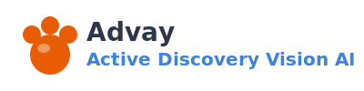

# Brand Assets

Brand assets for **Advay** — Active Discovery Vision AI for Youth.

---

## Brand Documentation

| Document | Purpose |
|----------|---------|
| `docs/BRAND_ARCHITECTURE_COMPLETE.md` | **Start here** — Dual-brand system (Advay + Pip) |
| `docs/BRAND_NAMING_EXPLORATION.md` | Naming journey, acronym options |
| `docs/BRAND_KIT_UNIFIED.md` | Visual design system (colors, type, spacing) |

---

## Asset Files

| File | Description | Usage |
|------|-------------|-------|
| `logo-mark.svg` | Paw print logo mark | Favicon, app icon, small UI |
| `logo-full.svg` | Wordmark + icon | Headers, marketing |
| `pip-avatar.svg` | Pip mascot illustration | Child UI, onboarding |
| `color-palette.css` | CSS color variables | Import into stylesheets |
| `color-palette-preview.svg` | Visual color reference | Documentation |

---

## Quick Start

### Colors

```css
@import url('assets/brand/color-palette.css');

.button {
  background: var(--pip-orange);  /* #E85D04 */
  color: white;
}

.text {
  color: var(--advay-slate);  /* #2D3748 */
}
```

### Tailwind Classes

```html
<!-- Primary button -->
<button class="bg-pip-orange text-white px-6 py-3 rounded-2xl">
  Get Started
</button>

<!-- Secondary button -->
<button class="border-2 border-vision-blue text-vision-blue">
  Learn More
</button>
```

### Logo Usage

```html
<!-- Logo mark only -->


<!-- Full logo -->

```

---

## Brand Colors

| Color | Hex | Usage |
|-------|-----|-------|
| **Pip Orange** | `#E85D04` | Primary CTAs, mascot branding |
| **Advay Slate** | `#2D3748` | Text, tech elements |
| **Discovery Cream** | `#FFF8F0` | Backgrounds |
| **Vision Blue** | `#3B82F6` | AI features, links |
| **Success Sage** | `#81B29A` | Success states |

---

## Font

**Nunito** — Rounded sans-serif from Google Fonts

```html
<link href="https://fonts.googleapis.com/css2?family=Nunito:wght@400;600;700;800&display=swap" rel="stylesheet">
```

---

## Brand Architecture

```
┌─────────────────────────────────────────────┐
│                                             │
│   ADVAY                                     │
│   Active Discovery Vision AI for Youth      │
│                                             │
│   + Pip the Red Panda                       │
│     (Playful Interactive Partner)           │
│                                             │
└─────────────────────────────────────────────┘
```

- **Advay** = The platform (parents, trust, tech)
- **Pip** = The companion (kids, fun, engagement)

---

*For complete guidelines, see `docs/BRAND_ARCHITECTURE_COMPLETE.md`*
