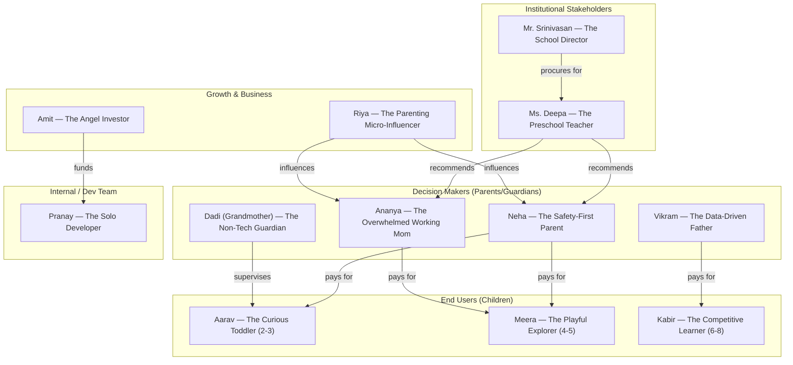

# Advay Vision — Comprehensive User Personas

**Date:** 2026-02-22  
**Version:** 1.0  
**Purpose:** A single source of truth for every persona that touches the Advay Vision ecosystem. Each persona includes detailed demographics, psychographics, goals, frustrations, the journey they take through the product, key product touchpoints, and design implications. This document should be referenced for every UX decision, feature prioritization, and marketing choice.

---

## Why These Personas Exist

Advay Vision sits at a unique intersection: it is a **camera-based, AI-powered educational web app** for children aged 2–8, built and operated by a solo developer, targeting a **global audience**. The product requires buy-in from parents (who pay), engagement from children (who play), and trust from educators and institutions (who recommend). Each persona below was selected because they represent a **distinct decision point, interaction pattern, or risk vector** that directly impacts product design, growth, and retention.

> [!NOTE]
> Many personas below use Indian names and contexts because the developer is based in India. The personas, their behaviors, and the design implications are **universally applicable** — a privacy-conscious parent in Mumbai behaves the same as one in Munich or Minneapolis.

---

## Persona Map

---

## Part 1: End Users — The Children

### Persona 1: Aarav — The Curious Toddler

| Attribute | Detail |
|---|---|
| **Age** | 2 years, 8 months |
| **Location** | Pune, Maharashtra |
| **Language** | Understands Marathi at home; exposed to English nursery rhymes |
| **Device Access** | Mother's iPad (shared), occasionally father's laptop |
| **Motor Skills** | Gross motor developing; fine motor limited (cannot pinch precisely) |
| **Attention Span** | 45–90 seconds per activity |
| **Reading Level** | Pre-literate; recognizes 3–4 letters by shape, not sound |

#### Why This Persona Was Chosen
Aarav represents the **youngest edge of the target demographic**. If the product works for him, it works for everyone. He is the ultimate stress test for: UI simplicity, gesture tolerance, audio-first design, and the "zero reading required" principle. Most competitor apps (ABCmouse, HOMER) effectively start at age 3+. Succeeding at age 2 is a differentiator.

#### Goals & Motivations
- **Cause-and-effect delight:** Wants to see something happen instantly when he moves his hand. The joy is in the reaction, not the learning outcome.
- **Bright, moving things:** Drawn to color, motion, and sound. Will stare at a spinning animation for 30 seconds.
- **Parental co-play:** Wants his mother to participate. Looks at her face for reassurance after every action.

#### Frustrations & Pain Points
- **Cannot understand text instructions.** If a game says "Pinch the red star," he sees shapes but cannot decode the sentence.
- **Imprecise hand control.** His pinch gesture is more of a full-hand grab. The pinch detection threshold must be extremely forgiving.
- **Overwhelmed by choice.** A grid of 16 game cards is a wall of noise. He needs 2–3 options, maximum.
- **Frightened by sudden loud sounds or aggressive failure feedback.** A buzzer sound will make him cry and refuse to play again.

#### Product Journey
1. **Entry:** Mother opens the app on iPad, selects Aarav's profile (or "Guest Player").
2. **Game Selection:** Mother taps a game for him (he does not navigate independently).
3. **Gameplay:** Aarav waves his hand in front of the camera. Pip says "I see your hand!" and a bubble pops. He laughs. He waves again. More bubbles. The loop is: wave → visual + audio reward → repeat.
4. **Session End:** After 2–3 minutes, Aarav loses interest or his mother closes the app. There is no "end screen" that matters to him.

#### Key Touchpoints & Design Implications

| Touchpoint | Design Implication |
|---|---|
| Hand detection threshold | Must accept open-palm "grab" as a valid gesture, not just precise pinch |
| Instruction delivery | 100% audio (Pip's voice) + animated visual demo. Zero text dependency |
| Failure feedback | Never a buzzer. Use soft "oops" with a giggle. Pip looks confused, not angry |
| Session length | Games should have natural 2-minute loops. No penalty for stopping mid-game |
| Visual density | Maximum 3 interactive elements on screen at once for this age band |
| Camera privacy | Mother must explicitly consent. Visual green dot indicator is critical |

---

### Persona 2: Meera — The Playful Explorer

| Attribute | Detail |
|---|---|
| **Age** | 4 years, 6 months |
| **Location** | Bengaluru, Karnataka |
| **Language** | Bilingual: Kannada at home, English at school |
| **Device Access** | Family tablet (Android), propped on a stand on the dining table |
| **Motor Skills** | Can point, tap, and do a deliberate pinch gesture |
| **Attention Span** | 3–5 minutes per activity if engaged; drops instantly if bored |
| **Reading Level** | Recognizes all 26 letters; can read 3-letter CVC words slowly |

#### Why This Persona Was Chosen
Meera is the **sweet spot user** — old enough to follow simple instructions, young enough to need the "play-first" design philosophy. She represents the core of the ₹2,999/year paying family. Her experience determines retention and word-of-mouth growth.

#### Goals & Motivations
- **"I did it!" moments:** Craves the celebration screen. Will replay a level just to see the confetti again.
- **Variety:** Gets bored of the same game after 3 sessions. Needs a fresh game or a new twist (new shapes, new words) every few days.
- **Pip as a friend:** Talks to the mascot. Says "Pip, watch me!" before doing a gesture. Expects Pip to react.
- **Stars and badges:** Understands the concept of collecting things. Will work hard to earn "3 stars."

#### Frustrations & Pain Points
- **Waiting.** If the hand tracking model takes 5+ seconds to load, she will tap the screen impatiently and break the gesture detection flow.
- **Ambiguous instructions.** "Put your finger on the shape" — which finger? She extends all five. The game should accept any finger.
- **Difficulty spikes without warning.** If Level 1 has 2 targets and Level 2 suddenly has 6, she will feel overwhelmed and quit.
- **"Where did Pip go?"** If the mascot disappears during gameplay (e.g., hidden by a modal), she feels alone.

#### Product Journey
1. **Entry:** Opens the app herself (knows where the icon is). Sees the dashboard. Taps her profile avatar.
2. **Game Selection:** Scrolls through the "Featured Games" carousel. Picks one based on the emoji icon and the color of the card (not the title text).
3. **Gameplay:** Follows Pip's spoken instructions. Pinches targets, earns stars. When stuck, pauses and calls out "Mama, help!"
4. **Session End:** Plays 2–3 games (8–12 minutes total). Ends when mother says "Pip needs a nap now."

#### Key Touchpoints & Design Implications

| Touchpoint | Design Implication |
|---|---|
| Game card selection | Large, colorful cards with emoji icons and Pip's recommendation badges |
| Loading state | Pip animation ("Pip is stretching!") to mask model load time |
| Difficulty progression | Gradual: add 1 new element per level, never jump |
| Celebration | Full-screen confetti + Pip dancing + sound effect. This IS the product for her |
| Multilingual | Pip should speak instructions in the child's `preferred_language` setting |
| Pip presence | Mascot must remain visible (corner of screen) during gameplay at all times |

---

### Persona 3: Kabir — The Competitive Learner

| Attribute | Detail |
|---|---|
| **Age** | 7 years, 3 months |
| **Location** | Noida, Uttar Pradesh |
| **Language** | Hindi at home, English at school (CBSE board) |
| **Device Access** | Own Android tablet (budget, ~₹12K device); also uses family laptop |
| **Motor Skills** | Fully developed fine motor. Can do precise pinch, draw letters in the air |
| **Attention Span** | 10–15 minutes if challenged; drops to 30 seconds if too easy |
| **Reading Level** | Fluent reader in English; reads Hindi slowly |

#### Why This Persona Was Chosen
Kabir represents the **upper boundary** of the target age range and the biggest churn risk. If the product feels "babyish," he tells his father "This is boring" and the family cancels. Retaining Kabir requires depth, challenge, and a sense of mastery that goes beyond "pop the bubble." He also represents the child who will be most vocal about wanting leaderboards and comparing scores with friends.

#### Goals & Motivations
- **Competition:** Wants to beat his own high score. Asks "What's the world record?"
- **Mastery & progression:** Wants harder levels. Feels proud when he unlocks a new game tier.
- **Independence:** Does not want his mother hovering. Wants to play alone.
- **Showing off:** Wants to show his score to his father. "Papa, look! I got 450 points!"

#### Frustrations & Pain Points
- **Patronizing tone.** If Pip says "Good try!" after a wrong answer, Kabir rolls his eyes. He wants specific feedback: "Close! It was RED, not PINK."
- **No challenge ceiling.** If the game maxes out at Level 3, he finishes in one session and never returns.
- **Slow pacing.** Celebration screens that linger for 3 seconds feel like forever. He wants to skip ahead.
- **Babyish visuals.** If the UI looks like it's for a 3-year-old (oversized buttons, pastel everything), he won't engage.

#### Product Journey
1. **Entry:** Opens the app independently. Notices his score and stars from last session on the dashboard.
2. **Game Selection:** Goes straight to "Games" page. Filters or scrolls to find new or advanced games. Ignores "easy" games.
3. **Gameplay:** Plays intensely. Tries to optimize his score. Gets frustrated if tracking lag causes a missed target. Plays 3–4 rounds of the same game to beat his score.
4. **Session End:** Stops when he's satisfied with his score or when called for dinner. Checks the Progress page before closing.

#### Key Touchpoints & Design Implications

| Touchpoint | Design Implication |
|---|---|
| Difficulty system | Must support 6+ levels. Hard mode should genuinely challenge |
| Feedback language | Specific and respectful: "That was ◇, you needed △" — not "Oops, try again!" |
| Celebration pacing | Shorter celebrations (1.5s); option to skip |
| Score display | Prominent, always visible. Personal best tracking |
| Visual maturity | Age-adaptive UI: slightly more muted colors, smaller targets, fewer emojis |
| Leaderboard (future) | Class-level or friend-level score comparison |

---

## Part 2: Decision Makers — Parents & Guardians

### Persona 4: Neha — The Safety-First Parent

| Attribute | Detail |
|---|---|
| **Age** | 32 |
| **Location** | Mumbai, Maharashtra |
| **Occupation** | HR Manager at a tech company |
| **Children** | Aarav (2y 8m) and Isha (5y) |
| **Household Income** | ₹1.8 lakh/month |
| **Tech Savviness** | High (uses UPI, online shopping, Instagram daily) |
| **Primary Concern** | Child safety, data privacy, screen time limits |

#### Why This Persona Was Chosen
Neha is the **primary conversion blocker**. She discovers the app through Instagram, thinks "this looks cool," but then hesitates at the camera permission screen. Her inner monologue: "Wait, this app needs the camera? Where is this video going? Who sees my child?" If the product fails to address her privacy concerns within 15 seconds, she abandons the trial and tells three other mothers "I didn't trust it."

#### Goals & Motivations
- **"Safe screen time":** Wants the guilt-free feeling that her children are learning, not just staring at a screen.
- **Privacy guarantee:** Needs explicit, simple confirmation that video is processed on-device and never uploaded.
- **Time controls:** Wants to set a 20-minute daily limit and have the app enforce it gently.
- **Progress visibility:** Wants a weekly summary: "Isha learned 5 new letters this week."

#### Frustrations & Pain Points
- **Camera permissions without context.** A system popup saying "Advay wants to access your camera" with no explanation will trigger an immediate "Deny."
- **No visible privacy policy.** If she has to search for the privacy policy, she assumes there isn't one.
- **Children's data collected.** Even anonymized analytics feel invasive. She needs "zero data leaves the device" messaging.
- **No session time controls.** If her child plays for 45 minutes straight, she blames the app, not the child.
- **Ads or upsells to children.** An in-app message saying "Upgrade to Premium!" shown to her 5-year-old is a deal-breaker.

#### Product Journey
1. **Discovery:** Sees an Instagram Reel showing a child tracing letters in the air with their hand. Thinks "That's clever."
2. **Evaluation:** Visits the website. Reads the hero section. Scrolls to the "Privacy Promise" section. If it says "Video never leaves the device," she's interested. If it doesn't mention privacy prominently, she closes the tab.
3. **Trial Signup:** Starts the 7-day free trial. Expects clear camera consent flow with visual explanation (not just a system prompt).
4. **First Session (supervised):** Sits with Isha for the first game. Watches the camera indicator. Checks that no "uploading" or "sending data" activity is visible.
5. **Trial-to-Paid Decision:** On day 5, checks the parent dashboard. If she sees a meaningful progress snapshot ("Isha traced 12 letters, matched 8 emojis"), she's likely to convert.
6. **Ongoing:** Checks the dashboard weekly. Forwards the weekly email summary to her husband.

#### Key Touchpoints & Design Implications

| Touchpoint | Design Implication |
|---|---|
| Camera consent | Custom in-app modal (not just the browser prompt) with visual: "🔒 Video stays on this device. We never see or store it." |
| Privacy indicator | Persistent green dot on screen during camera use; "LIVE — On Device Only" label |
| Session time limits | Parent settings: configurable daily limit (15/20/30 min). Pip says "Time to rest!" |
| Parent dashboard | Weekly email digest + in-app dashboard with skill breakdown per child |
| Pricing transparency | No hidden upsells. "₹2,999/year — everything included." No premium tiers shown to children |
| COPPA/DPDPA compliance | Verifiable parental consent (OTP-based); data deletion button in settings |

---

### Persona 5: Vikram — The Data-Driven Father

| Attribute | Detail |
|---|---|
| **Age** | 38 |
| **Location** | Hyderabad, Telangana |
| **Occupation** | Senior Data Analyst at an IT services company |
| **Children** | Kabir (7y 3m) |
| **Household Income** | ₹2.5 lakh/month |
| **Tech Savviness** | Very high (builds dashboards at work, uses spreadsheets for family budgeting) |
| **Primary Concern** | Measurable learning outcomes, ROI on educational spend |

#### Why This Persona Was Chosen
Vikram is the **retention decider for the most at-risk age group** (6-8). He has already tried and cancelled BYJU'S (₹12K wasted). He's skeptical of EdTech marketing claims. He won't pay ₹2,999/year unless he can see data proving his son is learning. He's also the persona most likely to churn after Month 3 if the product plateaus.

#### Goals & Motivations
- **Quantified learning:** Wants metrics: "Kabir's letter recognition improved from 60% to 92% in 4 weeks."
- **School alignment:** Wants to know if the app content maps to the CBSE/ICSE syllabus his son follows.
- **Competitive benchmarking:** "Is Kabir ahead or behind for his age?"
- **Value for money:** Compares ₹2,999/year against private tuition (₹3,000/month). The app needs to justify itself.

#### Frustrations & Pain Points
- **Vague progress reporting.** "Your child played 3 games" is useless. He wants "Kabir correctly identified 14/20 shapes with 70% accuracy."
- **No export.** He wants to download a PDF or CSV to show his wife or Kabir's teacher.
- **No curriculum mapping.** "What NCERT standard does this game teach?" If the answer is unclear, the product feels like entertainment, not education.
- **Stale content.** If Kabir finishes all games in 2 months, Vikram sees no reason to renew.

#### Key Touchpoints & Design Implications

| Touchpoint | Design Implication |
|---|---|
| Progress dashboard | Skill-level breakdown: Alphabets (85%), Numbers (72%), Shapes (91%). Trend charts |
| Weekly/monthly reports | Automated email with PDF attachment: skills learned, time spent, accuracy trends |
| Curriculum alignment | Game descriptions should reference learning standards (e.g., "Teaches NEP FLN: Phonemic Awareness") |
| Exportable data | "Download Progress Report" button (PDF, or shareable link) |
| Content roadmap | "Coming Soon" section showing planned new games to reduce churn anxiety |

---

### Persona 6: Ananya — The Overwhelmed Working Mom

| Attribute | Detail |
|---|---|
| **Age** | 29 |
| **Location** | Jaipur, Rajasthan (Tier 2 city) |
| **Occupation** | Freelance graphic designer (works from home) |
| **Children** | Saanvi (4y 2m) |
| **Household Income** | ₹55K/month |
| **Tech Savviness** | Medium (comfortable with UPI and WhatsApp; less comfortable with app settings) |
| **Primary Concern** | Needs 20 minutes of child-safe, self-directed activity so she can take a work call |

#### Why This Persona Was Chosen
Ananya represents the **highest-volume segment** for growth: Tier 2/3 city parents who need affordable, independent child engagement. She is price-sensitive (₹2,999/year is a considered purchase, not an impulse buy) and will only pay if the app genuinely keeps Saanvi engaged without needing Ananya to sit next to her. She is also the viral growth engine — if Advay works, she tells her WhatsApp parenting group (200+ members).

#### Goals & Motivations
- **"Buy me 20 minutes."** The app's real product for Ananya is uninterrupted work time.
- **Zero setup.** She cannot spend 5 minutes configuring profiles and permissions. Needs one-tap access.
- **Child safety net.** If Saanvi accidentally navigates away from the game, the app should contain her (no browser redirect, no YouTube link).
- **Social sharing.** If Saanvi draws a letter well, Ananya wants to screenshot it and share on WhatsApp.

#### Frustrations & Pain Points
- **Complex onboarding.** Multi-step registration, email verification, child profile setup — every extra step is a drop-off.
- **App crashes mid-session.** If the camera model fails and shows a white screen, Saanvi cries and Ananya loses her work call.
- **Payment friction.** She uses UPI exclusively. If the checkout only shows "Credit Card," she abandons.
- **No offline mode.** Her internet is inconsistent. If the game requires constant connectivity, it fails during power cuts.

#### Key Touchpoints & Design Implications

| Touchpoint | Design Implication |
|---|---|
| Onboarding | Maximum 3 steps: email → child age → start playing. Skip everything else |
| Guest mode | Allow immediate play without registration. Gate progress saving behind account creation |
| Error recovery | If camera/ML fails, show a fallback: "Pip is resting. Try the touch version!" (tap-based game) |
| Payment methods | UPI must be the primary, prominent option. Card entry is secondary |
| Offline support | Cache game assets + MediaPipe models locally. Show "Offline Mode" indicator |
| Shareability | "Share Saanvi's achievement" button → generates WhatsApp-friendly image with score |

---

### Persona 7: Dadi (Grandmother) — The Non-Tech Guardian

| Attribute | Detail |
|---|---|
| **Age** | 62 |
| **Location** | Lucknow, Uttar Pradesh |
| **Occupation** | Retired school principal |
| **Children in care** | Grandsons Aarav (2y 8m) and Kabir (7y 3m) — watches them while parents work |
| **Tech Savviness** | Low (can make WhatsApp video calls; struggles with app navigation) |
| **Primary Concern** | Not "breaking anything" on the device |
| **Language** | Hindi only; cannot read English UI |

#### Why This Persona Was Chosen
Dadi is the **invisible stakeholder** that most EdTech products ignore. In Indian families, grandparents are frequently the daytime caregivers. If Dadi cannot start the app and hand the tablet to the child, the product fails during its most critical usage window (weekday mornings when parents are at work). She also represents the need for Hindi (and other Indian language) support across the UI.

#### Goals & Motivations
- **Keep the grandchildren happy and learning.** She believes in education but trusts technology cautiously.
- **Not embarrass herself.** She doesn't want to ask for help every time she uses the app.
- **Simple, predictable flow.** "Tap here, game starts, child plays." Nothing else.

#### Frustrations & Pain Points
- **English-only UI.** She cannot read "Settings," "Progress," or "Start Game." Needs Hindi labels.
- **Accidental navigation.** If she swipes and ends up on the Settings page, she panics and closes the app entirely.
- **No "big button" mode.** Small text links and gear icons are invisible to her.
- **Camera permission popups in English.** She will always tap "Don't Allow" because she doesn't understand the prompt.

#### Key Touchpoints & Design Implications

| Touchpoint | Design Implication |
|---|---|
| Language support | Full Hindi UI translation (not just content, but navigation labels, buttons, modals) |
| Home screen | One giant "PLAY" button per child profile with the child's photo/avatar. Nothing else visible |
| Navigation guards | Prevent accidental exits. "Are you sure?" confirmation in Hindi before leaving a game |
| Camera consent | Pre-approved by parent during setup. Dadi should never see a camera permission dialog |
| Accessibility | Large tap targets (minimum 48×48px), high contrast text, no reliance on color alone |

---

## Part 3: Institutional Stakeholders

### Persona 8: Ms. Deepa — The Preschool Teacher

| Attribute | Detail |
|---|---|
| **Age** | 28 |
| **Location** | Chennai, Tamil Nadu |
| **Occupation** | Lead teacher at a Montessori preschool (25 children, ages 3–5) |
| **Tech Savviness** | Medium (uses Google Classroom for basic parent communication) |
| **Primary Concern** | Classroom logistics — 25 kids, 1 tablet, 45-minute "activity period" |

#### Why This Persona Was Chosen
Ms. Deepa represents the **B2B channel** (school pricing at ₹100/student/year). If she recommends Advay to parents, her word carries 10× the weight of an Instagram ad. However, she will only recommend a product that works in her reality: shared devices, noisy rooms, limited time, and the need to track individual progress across many children.

#### Goals & Motivations
- **Supplement her curriculum.** She teaches phonics and numeracy. Advay games should reinforce what she teaches, not conflict with it.
- **Manage 25 kids with 1 tablet.** Needs quick profile switching (child 1 plays for 3 minutes, then child 2).
- **Evidence for parent-teacher meetings.** "Aarav has mastered all 26 letters" — backed by data from the app.
- **Minimal setup.** She has 2 minutes between activities. Cannot troubleshoot tech issues.

#### Frustrations & Pain Points
- **No classroom mode.** Switching between 25 individual profiles is impractical.
- **No bulk reporting.** She can't generate a class-wide progress report for parent meetings.
- **Noise in the classroom.** Audio instructions from Pip are drowned out. Needs visual-only fallback.
- **Inconsistent internet.** School Wi-Fi is unreliable. Games must work offline.

#### Key Touchpoints & Design Implications

| Touchpoint | Design Implication |
|---|---|
| Classroom mode | Quick-switch roster: tap child's name → game starts immediately. No login per child |
| Bulk progress reports | Class-level dashboard: "15 of 25 children mastered letter tracing this week" |
| Offline first | All game assets cached locally after first download |
| Audio fallback | Visual instruction mode (animated Pip demos without sound) for noisy environments |
| Curriculum mapping | Tag games with NCERT/NEP learning outcomes for teacher credibility |

---

### Persona 9: Mr. Srinivasan — The School Director

| Attribute | Detail |
|---|---|
| **Age** | 52 |
| **Location** | Coimbatore, Tamil Nadu |
| **Occupation** | Founder-Director of a chain of 3 preschools (combined enrollment: 400 students) |
| **Tech Savviness** | Low-medium (delegates tech to his admin team) |
| **Primary Concern** | Differentiation from competitors; parent satisfaction scores |

#### Why This Persona Was Chosen
Mr. Srinivasan is the **B2B procurement decision-maker**. He doesn't use the product himself — he approves the budget. His decision is based on: (a) will this impress parents during admission season? (b) does it justify the cost? (c) is there a risk (privacy scandal, inappropriate content)? He represents the school partnership revenue channel (₹100/student/year × 400 students = ₹40,000/year per school × potential hundreds of schools).

#### Goals & Motivations
- **Competitive edge.** "We use AI-powered learning" is a marketing line for his next admission brochure.
- **Parent satisfaction.** If parents rave about Advay, they renew enrollment. His NPS goes up.
- **Zero operational risk.** No privacy incidents. No parental complaints about inappropriate content.
- **Cost efficiency.** ₹100/student/year is cheaper than buying Osmo kits (₹5,000+ per kit).

#### Frustrations & Pain Points
- **No branding options.** He wants the app to show his school's logo during the child's session. "Powered by [School Name]."
- **Long procurement process.** He needs a formal quotation, invoice, and GST bill.
- **Cannot evaluate quickly.** He won't play the games himself. Needs a 2-minute demo video tailored for school administrators.
- **Data liability.** If children's data is breached, his school is liable. Needs clear data processing agreement.

#### Key Touchpoints & Design Implications

| Touchpoint | Design Implication |
|---|---|
| Sales collateral | One-page PDF: "Why Advay for Schools" with cost comparison vs. Osmo/BYJU'S |
| Demo video | 90-second video showing a child playing + a teacher checking progress dashboard |
| White-labeling (future) | Option to add school logo to the app's loading screen |
| Invoicing | GST-compliant invoices via Dodo Payments. Bulk annual billing |
| Data processing agreement | Standard DPA template for Indian schools (DPDPA compliant) |

---

## Part 4: Growth & Business Personas

### Persona 10: Riya — The Parenting Micro-Influencer

| Attribute | Detail |
|---|---|
| **Age** | 31 |
| **Location** | Delhi NCR |
| **Occupation** | Stay-at-home mom / Instagram content creator (18K followers) |
| **Children** | Aanya (3y) and Vivaan (6y) |
| **Content Style** | "Real mom" aesthetic — unfiltered kitchen videos, messy playrooms, honest reviews |
| **Primary Concern** | Authenticity; will not promote a product she doesn't genuinely like |

#### Why This Persona Was Chosen
Riya is the **most cost-effective acquisition channel** (CAC: ₹80–₹120 per user via influencer partnerships). Her followers are exactly the target: young Indian parents in metros and Tier 2 cities. A single 60-second Reel of her child air-drawing letters can generate 500+ trial signups. However, she is discerning — a bad experience will result in a public negative review, not silence.

#### Goals & Motivations
- **Unique content.** Camera-based interaction is visually novel. It makes for great video content (child waving → letters appearing).
- **Honest review.** She'll share what's good AND what's broken. Transparency earns her followers' trust.
- **Affiliate revenue.** Wants a simple referral link with trackable commissions (₹50–₹100 per conversion).
- **Early access.** Wants to be "the first" to review new features. Exclusivity matters to her brand.

#### Frustrations & Pain Points
- **No shareable moments.** If the game doesn't produce a visual "wow moment" that looks good on camera, she can't make content.
- **Complex affiliate setup.** If she needs to register on a separate portal, fill forms, and wait for approval, she won't bother.
- **Broken features during her review.** If the hand tracking fails on camera during her recording session, the content is unusable.
- **No credit.** If her referral link doesn't track conversions, she feels unappreciated.

#### Key Touchpoints & Design Implications

| Touchpoint | Design Implication |
|---|---|
| Shareable moments | "Achievement screenshot" auto-generated after each game: child's name + score + colorful graphic |
| Referral program | Simple link-based referral: `advay.app/r/riya` → tracks conversions → pays ₹100 per paid signup |
| Stability | Hand/pose tracking must work reliably in varied lighting (influencers film in different rooms) |
| Demo mode | "Show Mode" that runs with pre-recorded hand data so she can demo without needing a child present |

---

### Persona 11: Amit — The Angel Investor

| Attribute | Detail |
|---|---|
| **Age** | 45 |
| **Location** | Bengaluru, Karnataka |
| **Occupation** | Partner at an early-stage EdTech/consumer fund (portfolio of 12 startups) |
| **Investment Thesis** | "Asset-light education platforms that can scale to 100K users with <₹1Cr investment" |
| **Primary Concern** | Unit economics, defensibility, and founder capability |

#### Why This Persona Was Chosen
Amit represents the **funding path**. Advay's investor pitch ("Tangible UI with $0 marginal hardware cost") directly addresses his thesis. Understanding his evaluation criteria shapes not just the pitch deck, but the product's architecture decisions (e.g., choosing WebAssembly over a native app to prove asset-light scalability).

#### Goals & Motivations
- **Proof of traction:** Wants to see 500+ paid families, >40% D30 retention, and <₹400 blended CAC before committing.
- **Technical defensibility:** MediaPipe is open-source, so "what stops a competitor from copying this?" He needs to hear about the proprietary data flywheel (game content + adaptive difficulty + engagement data).
- **Founder-market fit:** Solo dev building a camera-AI product for kids? He wants to see technical depth AND user empathy.
- **Exit path:** B2B school channel + potential acquisition by a Byju's/Unacademy/PhysicsWallah gives him a 5-year exit horizon.

#### Frustrations & Pain Points
- **Vague metrics.** "Thousands of users" without specifics is a red flag.
- **Over-engineered architecture.** A solo dev running Kubernetes is a warning sign. He wants lean infrastructure (Railway/Fly.io + Neon).
- **No competitive analysis.** If the founder hasn't studied ABCmouse, Kiddopia, and Osmo pricing, Amit questions market awareness.
- **Missing privacy story.** COPPA/DPDPA are not optional. Non-compliance is a lawsuit risk that kills deals.

#### Key Touchpoints & Design Implications

| Touchpoint | Design Implication |
|---|---|
| Metrics dashboard (internal) | Real-time analytics: DAU, MAU, D7/D30 retention, conversion rate, MRR |
| Architecture documentation | Clear, lean stack diagram showing cost per user at scale |
| Competitive moat | Document the data flywheel: more users → better adaptive difficulty → higher retention → more users |
| Compliance documentation | COPPA + DPDPA compliance checklist, privacy policy, data flow diagram |

---

## Part 5: Internal / Development Team

### Persona 12: Pranay — The Solo Developer

| Attribute | Detail |
|---|---|
| **Age** | Late 20s |
| **Location** | India |
| **Role** | Sole developer, designer, PM, QA, marketing, and operations |
| **Tech Stack** | React + Vite (frontend), FastAPI + PostgreSQL (backend), MediaPipe (ML) |
| **Hardware** | Mac M3 Max, 96GB RAM — high-end development machine |
| **Primary Concern** | Shipping features fast without introducing regressions |

#### Why This Persona Was Chosen
Pranay **is the team**. Every architectural decision must account for the constraint that one person maintains the entire stack. This persona exists to prevent the "Netflix architecture on a lemonade-stand budget" anti-pattern. Features that require dedicated DevOps, QA teams, or ongoing content creation pipelines are flagged as risky.

#### Goals & Motivations
- **Ship fast, iterate faster.** Prefers web deployment (instant updates) over native app stores (review delays).
- **Minimize operational burden.** Managed services (Neon, Railway) over self-hosted infrastructure.
- **Automate testing.** Cannot manually test 16+ games on every commit. Needs automated smoke tests.
- **Documentation as insurance.** If he's sick for a week, another developer should be able to pick up the codebase from the docs alone.

#### Frustrations & Pain Points
- **Context switching.** Fixing a backend auth bug at 10 AM, designing a game UI at 2 PM, and writing marketing copy at 6 PM is exhausting.
- **Scope creep.** Every conversation generates 5 new feature ideas. Needs ruthless prioritization.
- **Testing on real children.** Cannot test gesture UX with a mouse. Needs to physically sit with a child and observe.
- **No design system enforcement.** Without a design team, visual consistency drifts over time.

#### Key Touchpoints & Design Implications

| Touchpoint | Design Implication |
|---|---|
| Code architecture | Shared hooks (`useGameHandTracking`), shared components (`GameContainer`, `GameCursor`) to minimize per-game boilerplate |
| Deployment | Single `git push` → auto-deploy via Railway. No manual Docker orchestration |
| Testing | Playwright smoke tests for critical paths (login, game load, camera init) |
| Design consistency | Centralized theme tokens (`theme.ts`), component library, consistent color palette |
| Documentation | Architecture docs, this persona document, and inline code comments as "bus factor" insurance |

---

## Summary Matrix

| # | Persona | Type | Key Question They Answer | Priority |
|---|---|---|---|---|
| 1 | Aarav (2-3y) | End User | "Is this usable without reading?" | P0 |
| 2 | Meera (4-5y) | End User | "Is this fun enough to come back?" | P0 |
| 3 | Kabir (6-8y) | End User | "Is this challenging enough to not feel babyish?" | P1 |
| 4 | Neha (Safety Parent) | Decision Maker | "Is my child's privacy protected?" | P0 |
| 5 | Vikram (Data Dad) | Decision Maker | "Can I see measurable learning outcomes?" | P1 |
| 6 | Ananya (Working Mom) | Decision Maker | "Can my child play independently for 20 min?" | P0 |
| 7 | Dadi (Grandmother) | Decision Maker | "Can I use this without reading English?" | P1 |
| 8 | Ms. Deepa (Teacher) | Institutional | "Does this work in my classroom of 25 kids?" | P2 |
| 9 | Mr. Srinivasan (Director) | Institutional | "Will this impress parents and justify cost?" | P2 |
| 10 | Riya (Influencer) | Growth | "Can I make great content with this?" | P1 |
| 11 | Amit (Investor) | Business | "Are the unit economics defensible?" | P2 |
| 12 | Pranay (Solo Dev) | Internal | "Can I maintain this alone at scale?" | P0 |

---

## Appendix: Methodology & Prompts Used

This section documents the exact research process and prompts used to generate these personas, for transparency and reproducibility.

### Research Inputs

The following existing documents were read and synthesized before writing:

| Document | What Was Extracted |
|---|---|
| `docs/AUDIT_PERSONAS_GAMES_UX.md` | 8 existing lightweight persona sketches (Asha, Dev, Maya, Priya, Rajesh, Sunita, Ms. Sharma, Arjun). Used as a baseline to identify gaps |
| `docs/BRAND_MESSAGING_STRATEGY.md` | Brand voice rules (parent-facing vs child-facing), the 3 messaging pillars, Pip's personality, and UI copy guidelines |
| `docs/COMPREHENSIVE_PRICING_STRATEGY_2026-02-20.md` | Target demographics (income bands, city tiers), competitive landscape (ABCmouse, Kiddopia, Khan Academy Kids), pricing tiers (₹2,999/year), CAC benchmarks, and B2B school channel economics |
| `docs/BRAND_VOICE_MASCOT_GUIDE.md` | Pip mascot characterization and child-facing tone rules |
| `docs/ARCHITECTURE.md` | Tech stack context (React + Vite, FastAPI, MediaPipe WebAssembly) |
| `src/frontend/src/hooks/useHandTracking.ts` | Actual implementation of GPU/CPU fallback logic, confirming Proposal 1 in V2 Architecture doc |
| `src/frontend/src/components/Mascot.tsx` | Current mascot implementation (CSS-based, video overlay) |

### Prompt Given to the AI Agent

The user's exact request was:

> "create multiple detailed user personas, and document them, each one should capture why it was chosen, each detail, can be end user, can be dev. team, external stakeholders and so on, there are multiple ones in the docs but this should be done as a detailed fresh take"

Followed by mid-generation feedback:

> "document even the prompts used"

> "tg is not india first, india is there because i am in india"

### Persona Selection Rationale

Personas were selected to cover every **stakeholder role** that influences adoption, retention, or revenue:

| Category | Personas | Why This Category |
|---|---|---|
| **End Users (Children)** | 3 personas spanning 2-3y, 4-5y, 6-8y | Each age band has fundamentally different motor skills, attention spans, and motivation patterns. A gesture UI that works for a 7-year-old may be unusable for a 2-year-old |
| **Decision Makers (Parents)** | 4 personas with different priorities | Parents are the buyer, not the user. Their concerns (privacy, outcomes, convenience, language) vary dramatically and each one is a potential conversion blocker or churn trigger |
| **Institutional** | 2 personas (teacher + director) | B2B school channel is a revenue multiplier. Teacher = recommender, Director = budget approver — different needs |
| **Growth** | 2 personas (influencer + investor) | Influencer = lowest-CAC acquisition channel. Investor = funding path. Both evaluate the product differently than end users |
| **Internal** | 1 persona (solo developer) | Every feature decision must pass the "can one person maintain this?" filter. This persona prevents architectural over-engineering |

### Generation Process

1. **Research phase** (5 min): Read existing persona docs, brand strategy, pricing strategy, and codebase hooks to understand the product's current state and market positioning.
2. **Gap analysis**: Identified that existing personas were audit-focused ("what to test") rather than product-design-focused ("who are we building for and why"). Also missing: grandparent caregiver, influencer, investor, and developer personas.
3. **Writing phase**: Each persona was structured with: demographics table → "Why This Persona Was Chosen" rationale → goals/motivations → frustrations → realistic product journey → design implications table.
4. **Feedback integration**: Removed India-first framing per user correction; added this methodology appendix per user request.

---

## Version History

| Version | Date | Author | Changes |
|---|---|---|---|
| 1.0 | 2026-02-22 | Antigravity | Initial comprehensive persona document |
| 1.1 | 2026-02-22 | Antigravity | Removed India-first framing (product is global); added Methodology & Prompts appendix |
