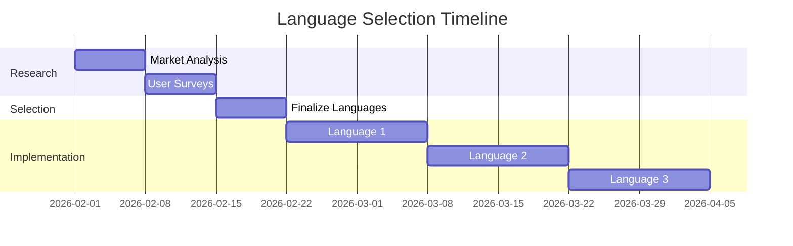
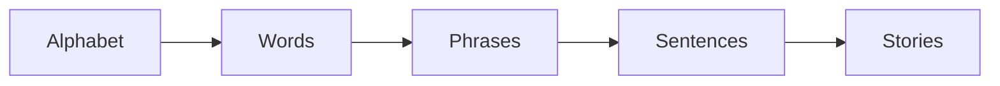

# Multi-Language Expansion Plan (TCK-20260129-102)

**Date:** 2026-01-29
**Status:** PLANNING
**Priority:** HIGH
**Owner:** Mistral Vibe

---

## 🌍 Vision: Global Learning Platform

**Goal:** Expand from Indian languages to global languages while maintaining cultural relevance and educational effectiveness.

**Principle:** "Think Global, Teach Local" - Global platform with localized content and cultural context.

---

## 📋 Current State (Phase 1: Indian Languages)

### ✅ Implemented

- **English**: A-Z (26 letters)
- **Hindi**: 43 letters (13 Swar + 30 Vyanjan)
- **Kannada**: 49 letters
- **Telugu**: Defined in codebase
- **Tamil**: Defined in codebase

### ✅ Features

- Game language selector (separate from UI language)
- Hand tracking for all scripts
- Cultural emojis and colors
- Pronunciation guides

### ✅ Infrastructure

- Multi-language data structure
- Language fallback system
- Settings persistence

---

## 🚀 Phase 2: Global Expansion (Next 3 Months)

### 📅 Timeline: Q2 2026

#### 1. **Language Prioritization** (Week 1-2)



#### 2. **Proposed Languages**

| Language | Script | Region | Priority | Notes |
|----------|--------|--------|----------|-------|
| **Spanish** | Latin | Latin America | HIGH | 500M+ speakers |
| **Arabic** | Arabic | Middle East | HIGH | RTL support needed |
| **Chinese** | Hanzi | China | MEDIUM | Complex characters |
| **French** | Latin | Europe/Africa | HIGH | Education focus |
| **Russian** | Cyrillic | Russia | MEDIUM | Technical |
| **Japanese** | Kanji/Hiragana | Japan | MEDIUM | Complex system |
| **German** | Latin | Europe | MEDIUM | Education focus |
| **Portuguese** | Latin | Brazil | HIGH | Similar to Spanish |

#### 3. **Selection Criteria**

- **Speaker Population**: 50M+ native speakers
- **Education Need**: Countries with child education gaps
- **Cultural Fit**: Aligns with playful learning approach
- **Technical Feasibility**: Script complexity and RTL support
- **Market Potential**: Growth opportunities

---

## 📋 Phase 3: Language Implementation Plan

### **Template for New Language Addition**

```typescript
// src/frontend/src/data/alphabets.ts

// [Language] Alphabet
export const [language]Alphabet: Alphabet = {
  language: '[lang]',
  name: '[Native Name] ([English Name])',
  letters: [
    { char: '[char]', name: '[word]', emoji: '[emoji]', color: '[color]', pronunciation: '[pronunciation]' },
    // ... all letters
  ],
};
```

### **Implementation Checklist**

1. **Data Collection**
   - [ ] Alphabet letters (A-Z equivalent)
   - [ ] Common words for each letter
   - [ ] Cultural emojis
   - [ ] Pronunciation guides
   - [ ] Color associations

2. **Technical Implementation**
   - [ ] Add to alphabets.ts
   - [ ] Add to LANGUAGES array
   - [ ] Add to language selector
   - [ ] Test hand tracking
   - [ ] Test audio pronunciation

3. **Quality Assurance**
   - [ ] Native speaker review
   - [ ] Cultural appropriateness
   - [ ] Child-friendly content
   - [ ] Accessibility compliance

4. **Deployment**
   - [ ] Feature flag for gradual rollout
   - [ ] A/B testing
   - [ ] User feedback collection
   - [ ] Analytics tracking

---

## 🎯 Technical Considerations

### **1. Script Support**

| Script Type | Examples | Challenges | Solution |
|------------|----------|------------|----------|
| **Latin** | English, Spanish | ✅ Easy | Standard implementation |
| **Abjad** | Arabic, Hebrew | RTL, cursive | CSS direction, shaping |
| **Abugida** | Hindi, Thai | Complex shaping | Unicode shaping libraries |
| **Logographic** | Chinese, Japanese | Thousands of chars | Prioritize common chars |
| **Syllabary** | Japanese Kana | Simpler | Standard implementation |

### **2. RTL (Right-to-Left) Support**

```css
/* CSS for RTL languages */
[dir="rtl"] {
  text-align: right;
}

/* Language-specific styling */
.arabic, .hebrew {
  font-family: 'Noto Sans Arabic', 'Arial', sans-serif;
}
```

### **3. Font Requirements**

- **Noto Sans**: Comprehensive Unicode coverage
- **Google Fonts**: Free and widely available
- **System Fallbacks**: Ensure readability
- **Font Loading**: Performance optimization

---

## 📊 Language-Specific Features

### **1. Cultural Adaptation**

Each language should include:

- **Cultural Emojis**: 🎌 (Japanese), 🕌 (Arabic), 🏯 (Chinese)
- **Color Associations**: Red (Chinese luck), Blue (Hindu divine)
- **Common Words**: Child-friendly vocabulary
- **Pronunciation**: Audio guides for non-native speakers

### **2. Learning Patterns**

- **Latin Scripts**: A-Z progression
- **Abjad Scripts**: Shape-based learning
- **Logographic**: Radical-based grouping
- **Syllabary**: Sound-based progression

### **3. Hand Tracking Adaptation**

- **Stroke Order**: For Chinese/Japanese
- **Cursive Connectors**: For Arabic
- **Character Complexity**: Adjust difficulty

---

## 🔧 Infrastructure Requirements

### **1. Backend Support**

- **Database**: Store language progress
- **API**: Language-specific endpoints
- **Validation**: Language code validation
- **Fallbacks**: Graceful degradation

### **2. Frontend Support**

- **i18n**: Internationalization library
- **RTL**: Right-to-left support
- **Fonts**: Dynamic font loading
- **Testing**: Language-specific tests

### **3. Content Management**

- **CMS**: Language content updates
- **Translation**: Professional translation workflow
- **Localization**: Cultural adaptation
- **Moderation**: Content review process

---

## 📈 Success Metrics

### **Quantitative**

- **Adoption Rate**: % users trying new languages
- **Retention**: Session length by language
- **Completion**: Letters learned per language
- **Engagement**: Time spent per language

### **Qualitative**

- **User Feedback**: Language-specific surveys
- **Cultural Fit**: Native speaker reviews
- **Educational Impact**: Learning effectiveness
- **Accessibility**: Ease of use ratings

---

## 🎓 Educational Strategy

### **1. Language Learning Progression**



### **2. Difficulty Levels**

| Level | Content | Duration |
|-------|---------|----------|
| Easy | 5 letters | 1 week |
| Medium | 10 letters | 2 weeks |
| Hard | Full alphabet | 4 weeks |
| Master | Words/phrases | 8 weeks |

### **3. Gamification**

- **Badges**: Language completion badges
- **Streaks**: Daily practice streaks
- **Leaderboards**: Language-specific leaderboards
- **Rewards**: Cultural rewards and unlocks

---

## 🚀 Roadmap

### **Q2 2026: Foundation**

- [ ] Finalize first 3 languages
- [ ] Implement RTL support
- [ ] Build font loading system
- [ ] Create language templates

### **Q3 2026: Expansion**

- [ ] Add 3-5 new languages
- [ ] Localization testing
- [ ] User feedback integration
- [ ] Analytics dashboard

### **Q4 2026: Optimization**

- [ ] Performance optimization
- [ ] Language pack system
- [ ] Offline support
- [ ] Community contributions

### **2027: Global Scale**

- [ ] 10+ languages supported
- [ ] Regional partnerships
- [ ] Localized marketing
- [ ] Educational partnerships

---

## 📝 Documentation Requirements

### **1. User Documentation**

- **Getting Started**: Language selection guide
- **Language Guides**: Pronunciation and writing
- **Cultural Notes**: Context for each language
- **Troubleshooting**: Common issues

### **2. Developer Documentation**

- **Adding Languages**: Step-by-step guide
- **Technical Specs**: Script requirements
- **API Reference**: Language endpoints
- **Testing Guide**: Language-specific tests

### **3. Content Documentation**

- **Style Guide**: Language conventions
- **Translation Guide**: Best practices
- **Cultural Guide**: Sensitivity guidelines
- **Review Process**: Quality assurance

---

## 🎯 Control Systems

### **1. Quality Control**

- **Automated Testing**: Language regression tests
- **Manual Review**: Native speaker validation
- **User Testing**: Beta testing programs
- **Analytics**: Usage pattern monitoring

### **2. Version Control**

- **Feature Flags**: Gradual language rollouts
- **A/B Testing**: Language variant testing
- **Canary Releases**: Limited audience testing
- **Rollback Plans**: Language-specific rollbacks

### **3. Documentation Control**

- **Versioning**: Language pack versions
- **Changelogs**: Language update logs
- **Deprecation**: Language retirement policy
- **Archiving**: Historical language data

---

## 🌐 Future Vision

### **1. Global Reach**

- **2026**: 5-10 languages
- **2027**: 15-20 languages
- **2028**: 25+ languages
- **2030**: Global coverage

### **2. Cultural Exchange**

- **Language Exchange**: Peer learning
- **Cultural Events**: Virtual celebrations
- **Community**: Language communities
- **Collaboration**: Global contributors

### **3. Educational Impact**

- **Literacy**: Improve global literacy
- **Accessibility**: Language access for all
- **Preservation**: Endangered language support
- **Innovation**: AI-powered learning

---

## 📋 Action Plan

### **Immediate (Next 2 Weeks)**

- [ ] Test game language selector (TCK-20260129-093)
- [ ] Finalize first 3 global languages
- [ ] Implement RTL support
- [ ] Create language contribution guide

### **Short-term (Next Month)**

- [ ] Add Spanish language support
- [ ] Add Arabic language support
- [ ] User testing and feedback
- [ ] Analytics integration

### **Medium-term (Next Quarter)**

- [ ] Expand to 5+ languages
- [ ] Localization testing
- [ ] Performance optimization
- [ ] Community contributions

### **Long-term (Next Year)**

- [ ] 10+ languages supported
- [ ] Regional partnerships
- [ ] Educational impact studies
- [ ] Global expansion

---

## 🎉 Conclusion

This plan outlines a comprehensive strategy for transforming the Learning for Kids platform from an Indian-focused application to a truly global learning platform. By systematically expanding language support while maintaining quality, cultural relevance, and educational effectiveness, we can empower children worldwide to learn in their native languages and explore new cultures.

**Next Steps:**

1. Finalize language selection for Phase 2
2. Implement technical infrastructure
3. Begin language content creation
4. Test and iterate with users

**Success Metrics:**

- Language adoption rates
- User engagement by language
- Learning effectiveness
- Global reach and impact

**Vision:** A world where every child can learn in their native language and explore the world through playful, culturally-relevant education. 🌍🎓
