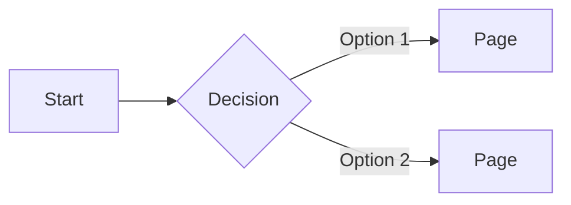

# UX Flow Analysis Prompt v1.0

**Purpose**: Systematically analyze user flows, identify friction points, and document user story issues in a web/mobile application.

**Target**: Any AI agent performing UX review

---

## Instructions

You are a UX analyst reviewing an application for flow issues, user journey friction, and user story gaps. Follow this structured approach:

---

## Phase 1: Discovery

### 1.1 Identify User Personas
List the primary user types and their goals:
```
- Persona: [Name/Type]
  - Age range: [if relevant]
  - Technical skill: [low/medium/high]
  - Primary goal: [what they want to accomplish]
  - Frustration tolerance: [low/medium/high]
```

### 1.2 Map All Entry Points
Find where users can start their journey:
- Direct URLs
- Navigation links
- Deep links
- Redirects from auth

### 1.3 Identify Core User Stories
For each major feature, document:
```
As a [persona],
I want to [action],
So that [outcome].

Acceptance criteria:
- [ ] ...
```

---

## Phase 2: Flow Mapping

### 2.1 Click-Path Analysis
For each core journey, count clicks/taps to completion:

| Journey | Steps | Path | Friction Points |
|---------|-------|------|-----------------|
| [name]  | [N]   | Page1 → Page2 → ... | [issues] |

**Red flags:**
- More than 3 clicks to primary action
- More than 5 clicks to any action
- Redundant screens
- Repeated information entry

### 2.2 Decision Point Audit
List every place users must make a choice:
```
- Location: [page/component]
- Decision: [what they choose]
- Options: [how many]
- Reversible: [yes/no]
- Default provided: [yes/no]
```

**Red flags:**
- More than 4 options without defaults
- Irreversible decisions without confirmation
- No "recommended" option for novice users
- Technical jargon in options

### 2.3 State Persistence Check
For each user preference/setting:
```
- Setting: [name]
- Stored: [yes/no]
- Where: [localStorage/backend/session]
- Survives refresh: [yes/no]
- Survives logout: [yes/no]
```

**Red flags:**
- User re-enters same info repeatedly
- Settings reset unexpectedly
- No "remember my choice" option

---

## Phase 3: Friction Analysis

### 3.1 Loading States
For each async operation:
- Is there a loading indicator?
- How long before timeout/error?
- Can user cancel?
- Is progress shown for long operations?

### 3.2 Error States
For each possible error:
- Is error message user-friendly?
- Is recovery path clear?
- Can user retry without losing progress?

### 3.3 Empty States
For each list/collection:
- What shows when empty?
- Is there a call-to-action?
- Is it encouraging, not discouraging?

### 3.4 Interruption Recovery
- What happens if user navigates away mid-flow?
- Is progress saved?
- Can they resume?
- Are there "draft" states?

---

## Phase 4: Accessibility & Inclusivity

### 4.1 Input Methods
- Keyboard navigation works?
- Touch targets adequate (48px+)?
- Mouse hover states exist?
- Voice control compatible?

### 4.2 Cognitive Load
- Instructions clear and concise?
- Too much text on screen?
- Visual hierarchy guides attention?
- Can user skip tutorials?

### 4.3 Time Pressure
- Are there unnecessary timers?
- Can users pause timed activities?
- Are time limits appropriate for audience?

---

## Phase 5: Output Format

### Summary Table
| Issue | Severity | Location | Recommendation |
|-------|----------|----------|----------------|
| [description] | P0/P1/P2/P3 | [file/page] | [fix] |

### Flow Diagrams
Use Mermaid to visualize:


### Prioritized Recommendations
Group fixes by:
1. **P0 - Blockers**: Users cannot complete core journey
2. **P1 - Major friction**: Users struggle but can complete
3. **P2 - Minor friction**: Annoyances that don't block
4. **P3 - Polish**: Nice-to-have improvements

---

## Example Usage

```
Analyze the user flows in this application:
- Target audience: Children ages 3-8
- Core journeys: Starting a game, completing a level, viewing progress
- Focus areas: Click count, decision fatigue, accessibility

Use prompts/ux/ux-flow-analysis-v1.0.md as your framework.
```

---

## Checklist for Quick Review

- [ ] Can user reach primary action in ≤3 clicks?
- [ ] Are there redundant screens or modals?
- [ ] Does the app remember user preferences?
- [ ] Is there a "quick resume" for returning users?
- [ ] Are defaults sensible for target audience?
- [ ] Can user skip optional steps?
- [ ] Is progress saved on interruption?
- [ ] Are error messages actionable?
- [ ] Is loading feedback immediate (<100ms)?
- [ ] Are touch targets large enough?

---

**Version**: 1.0  
**Last Updated**: 2026-02-02  
**Author**: AI Agent
